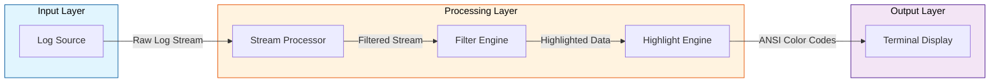
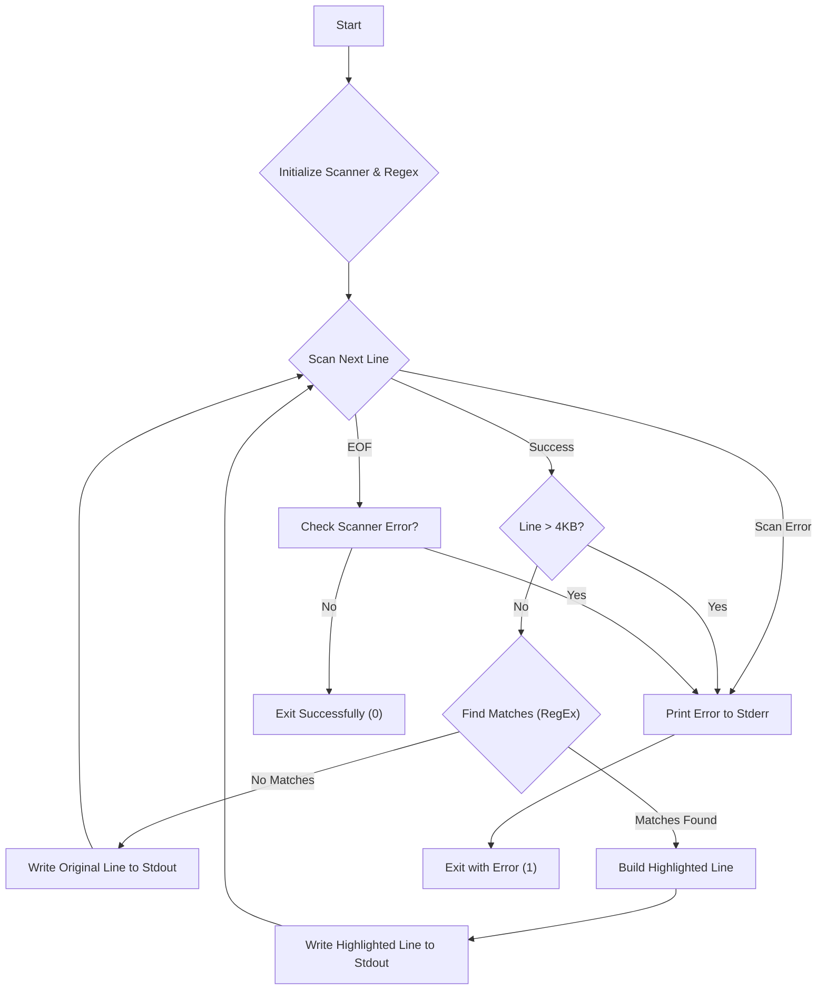

Imagine you're a senior software engineer specializing in Unix utilities and command-line tools, experienced in developing single-purpose programs that excel at specific tasks while integrating seamlessly into pipeline architectures. Proficient in stream processing, system-level programming, and command-line interface design, with a deep understanding of stdin/stdout handling and process communication patterns.
Confirm your role concisely.

Below is a draft technical specification and you have to suggest how to improve it.
<tech_spec>

# Technical Specification: Live Log Highlighter (Phase 1 - Refined Go Implementation)

**Version:** 1.3 (Adding Attachments: Flowchart & ANSI Codes)
**Date:** 2025-04-25
**Contributors:** Gemini 2.5 Pro (experimental)

## 1. Introduction

This document outlines the technical specifications for Phase 1 of the `loghl` (Live Log Highlighter) command-line utility. The goal of this phase is to create a foundational tool **implemented in Go**, capable of reading a stream, highlighting a predefined pattern.

## 2. Goal

Implement the core capability in Go to read from `stdin`, apply a single, predefined, case-insensitive regular expression for the pattern "error", highlight all matches in bright red, and handle specific input errors (encoding, line length).

## 3. Functional Requirements

* **Input:** Accept streaming text input from standard input (`stdin`).
    * **Encoding:** Input MUST be valid UTF-8.
* **Processing:** Read input line by line. The definition of a "line" is a sequence of bytes ending in a newline character (`\n`). See the Program Logic Flowchart (Attachment 7.1) for a visual overview.
* **Pattern Matching:**
    * Implement a **predefined, case-insensitive regular expression to match the substring "error"**.
* **Highlighting:**
    * Implement **bright red** as the predefined highlight color using ANSI escape codes (See Attachment 7.2).
* **Output:** Write processed lines to standard output (`stdout`).
    * For each line read from `stdin` (that doesn't trigger an error):
        * Find all non-overlapping matches for the predefined regular expression.
        * Wrap **only the matched substrings** in the specified bright red ANSI escape codes.
        * Non-matching portions of the line, and lines with no matches, remain unchanged.
        * Original line endings received from `stdin` should be preserved in the output (handled implicitly by writing the scanned line).

## 4. Non-Functional Requirements

* **Performance:** Process the input stream with minimal latency suitable for interactive log viewing.
* **Resource Usage:** Maintain minimal memory footprint and CPU utilization.
* **Target Language:** Go
* handling basic error conditions according to Go best practices

## 5. Go Implementation Details

The program will be structured using standard Go practices and packages:

* **Components:**
    * **Main Functionality:**
        * The program's entry point initializes the necessary components and orchestrates the overall execution. It sets up the regular expression for pattern matching and processes the input stream. Any critical setup errors, such as regex compilation failure, are logged and terminate the program.
    * **Regex Initialization:**
        * A predefined, case-insensitive regular expression for the word "error" is compiled at the start of the program. This ensures efficient reuse during input processing. The regex is stored in a global variable for accessibility across functions. Refer to Attachment 7.2 for the regex details.
    * **Input Processing:**
        * The program reads input line by line using a buffered scanner. The scanner is configured to handle lines up to 4KB in length, as specified in the functional requirements. Each line is processed to detect and highlight matches for the predefined pattern. Errors encountered during scanning, such as invalid UTF-8 encoding or excessively long lines, are handled gracefully.
    * **Line Highlighting:**
        * Each line is analyzed for matches using the compiled regex. If matches are found, the matched substrings are wrapped in ANSI escape codes for bright red highlighting (see Attachment 7.2). Non-matching portions of the line remain unchanged. The highlighted line is then written to the output stream. If no matches are found, the original line is written as-is.
    * **Error Handling:**
        * Errors encountered during input processing, such as I/O issues or line length violations, are logged with descriptive messages. The program exits with a non-zero status code to indicate failure. Refer to Attachment 7.3 for error handling specifics.

## 6. Testing Strategy (Examples)

* Compile the Go program (`go build`).
* Pipe input containing various test cases (lines with/without `error` in different cases, multiple errors, substrings, UTF-8 chars, empty lines).
* Verify `stdout` for correct highlighting and unmodified lines/parts.
* Pipe input with invalid UTF-8 sequences. Verify `stderr` message and non-zero exit code.
* Pipe input with a line > 4KB. Verify `stderr` message (likely mentioning "token too long" or similar) and non-zero exit code.

## 7. Attachments



### 7.1 Program Logic Flowchart



### 7.2 ANSI Escape Codes

* **Bright Red Start:** `\033[91m`
* **Reset/End:** `\033[0m`

### 7.3 Error Handling

* **Invalid Encoding / IO Errors / Line Length Limit:** These conditions will be detected primarily by the `bufio.Scanner`. If `scanner.Scan()` returns `false`, check `scanner.Err()`:
    * If `scanner.Err()` is not `nil`, it indicates an error (e.g., I/O error, token too long).
    * The tool must print a clear, specific error message derived from `scanner.Err()` to `stderr` (e.g., "Error reading stdin: [scanner.Err()]").
    * Exit immediately with a non-zero status code (`os.Exit(1)`).
    * *Note:* The `bufio.Scanner`'s buffer configuration directly enforces the line length limit. An error like `bufio.ErrTooLong` signals this violation. UTF-8 validation is implicitly handled during scanning; invalid sequences may also result in scanner errors. Refer to the flowchart (Attachment 7.1) for error exit points.

### 7.4 Implementation recommendations

#### Architecture Improvements

1. **Component Separation**
  - Extract interface definitions for:
```go
type PatternMatcher interface {
    Match([]byte) [][]int
}

type Highlighter interface {
    Apply([]byte, [][]int) []byte
}

type ErrorHandler interface {
    Handle(error)
}
```
  - Benefits:
    - Testability
    - Extensibility
    - Clear component responsibilities

2. **Error Handling Enhancement**
  - Implement custom error types:
```go
var (
    ErrLineTooLong = errors.New("line exceeds maximum length")
    ErrInvalidUTF8 = errors.New("invalid UTF-8 encoding")
)

func handleError(err error) {
    switch {
    case errors.Is(err, bufio.ErrTooLong):
        log.Printf("Error: %v\n", ErrLineTooLong)
    case err != nil:
        log.Printf("Error: %v\n", err)
    }
    os.Exit(1)
}
```

3. **Performance Optimizations**  - Buffer management:
```go
scanner.Buffer(make([]byte, 0, initialBufferSize), maxLineLength)
```
  - Memory efficiency improvements:
    - Reuse byte slices
    - Minimize string allocations
    - Pre-allocate buffers

#### Testing Strategy Enhancement

1. **Unit Tests**
```go
func TestPatternMatcher(t *testing.T) {
    matcher := NewPatternMatcher()
    testCases := []struct {
        input string
        want  [][]int
    }{
        {"ERROR: system failure", [][]int{{0, 5}}},
        {"no error here", [][]int{}},
    }
    // ... test implementation
}
```

2. **Integration Tests**
```go
func TestEndToEndProcessing(t *testing.T) {
    tests := []struct {
        input    string
        expected string
    }{
        {"ERROR occurred", "\033[91mERROR\033[0m occurred"},
        {"No error", "No error"},
    }
    // ... test implementation
}
```

## 8. Future Considerations (Post Phase 1)

* Dynamic rule management (add/remove regex + color pairs via UI).
* Multiple concurrent rules.
* Rule prioritization.
* Configuration persistence.
</tech_spec>
